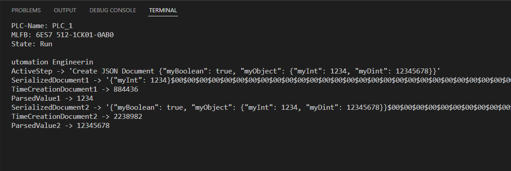
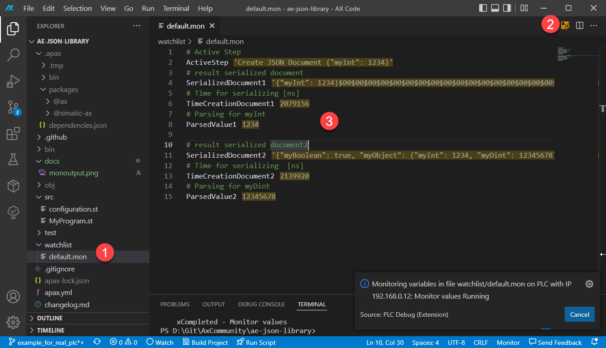

# JSON Application Example

## Description
This application example demonstrates the usage of the [JSON Library](https://github.com/simatic-ax/json)

This application example consists of two parts.

1. Showing the usage of the library in a PLC Program, which can be downloaded to a 1500 PLC or PLCSIM Advanced
1. Many examples as UnitTest in the `test` folder

## Install the application example and open it locally

1. Open a command line interface (CLI) and switch to the target folder like:
      ```sh
      D:
      cd \Examples
      ```
1. Install the application example `AX Code`

      Run the following commands in a CLI
      ```sh
      apax create @simatic-ax/ae-json-library --registry https://npm.pkg.github.com ae-json-library
      axcode ae-json-library
      ```

### Description of the PLC program
   
   The PLC program executes different steps:

   1. CreateDocument1 
      Add an JSON element of type Integer with value `1234` in a empty JSON document `doc`
   
   1. SerializeDocument1

      doc.Serialize(doc.buffer) serializes the JSON document `doc` into the array of char (doc.buffer).

      Expected result in the array of char: `{"myInt": 1234}`
   
      In this step, the time for serializing will be measured and stored in the variable `TimeCreationDocument1`. The result od serializing will be stored in the string variable `SerializedDocument1`

   1. ParseDocument1
   
      Parse the JSON document `doc` for the `key = myInt` and get the value `1234`
      
   1. ResetJSonDocument1

      Delete all JSON elements in the JSON document `doc`. So it's possible to create a new JSON document with other JSON elements.
   
   1. CreateDocument2

      Create a JSON document with nested JSON elements. Structure of nested JSON document:
      
      ```
      doc 
       |
       +- myBoolean(value = true)
       |
       +- myObject -+- myInt(value = 1234)
                    | 
                    +- myDint(value = 12345678)
      ```

   
   1. SerializeDocument2
   
      doc.Serialize(doc.buffer) serializes the JSON document `doc` into the array of char (doc.buffer).

      Expected result in the array of char: `{"myBoolean": true, "myObject": {"myInt": 1234, "myDint": 12345678}}`

      In this step, the time for serializing will be measured and stored in the variable `TimeCreationDocument2`. The result od serializing will be stored in the string variable `SerializedDocument2`


   1. ParseDocument2

      Parse the JSON document `doc` for the `key = myDint` and get the value `12345678`
   
   1. ResetJSonDocument2

      Delete all JSON elements in the JSON document `doc`. So it's possible to create a new JSON document with other JSON elements.

## Start the application example

1. Start a PLCSIM Advanced Instance or using a 1500 PLC. Download a TIA Portal created HWCN with a 1500 standard PLC (Default IP Address 192.168.0.1).

      > The default ip address can be changed in the apax.yml
      > ```yml
      > IP_ADDRESS: "192.168.0.1"
      > ```
      

1. If not open, open a terminal in AX Code (`CTRL+SHIFT+ö`)

1. Start the application example 
   
   ```cli
   apax start [1500]
   ```
   > `1500` is required, if you use a real 1500 PLC instead of PLCSIM Advanced.

      Result:

      After the Download you'll see following conten in the terminal. Exit by pressing `x`.

      

1. Monitor voa mon-File:
   
      

   1. Open the file `default.mon`
   1. Enable monitoring
   1. Observe the values


## Contribution

Thanks for your interest in contributing. Anybody is free to report bugs, unclear documentation, and other problems regarding this repository in the Issues section or, even better, is free to propose any changes to this repository using pull requests.


## License and Legal information

Please read the [Legal information](LICENSE.md)